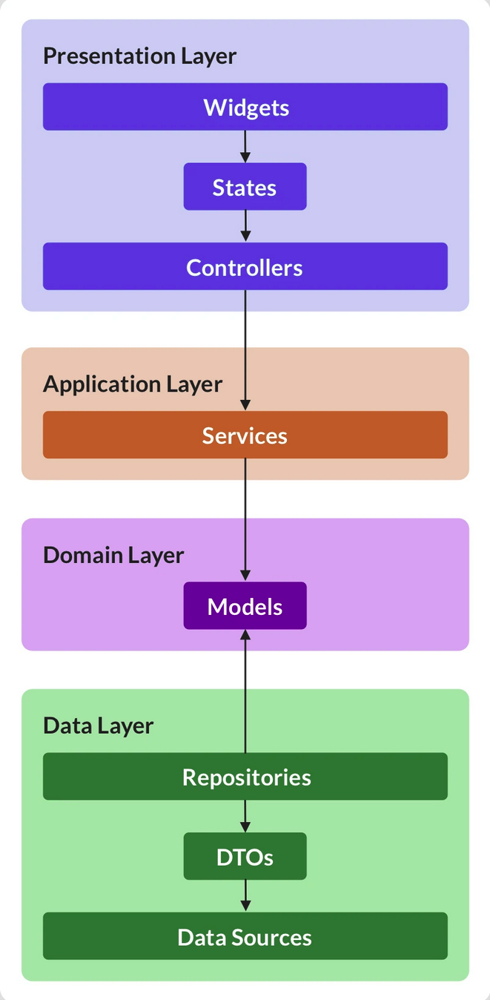

= ADR 005 - Mobile App Architecture
Daniel Karzel <daniel@10101.finance>
3.0, July 29, 2022: AsciiDoc article template
:toc:
:icons: font
:attributes: 2023-02-02

This document contains the reasoning for high level architecture and project structure decisions for the mobile app.

== Decision

* Application State and data storage are handled in the mobile app's native rust code.
** Whenever data is required the app should ask the native backend for data.
** Widget state should be kept on the presentation layer.
* The domain model is mostly defined in rust.
** It is recommended to keep the internal domain model used in the business logic encapsulated in the native code and expose a separate domain model on the API.
** There must be a separate DTO model for the app's database.
** We will likely still need some models in Dart, but they should be added for presentation and presentation controller purposes only. Examples are: a model to cache data until it is complete and can be handed over to the API to be stored, or a model that aggregates API data for display purposes.
* We use a feature-first structure for the project files because it will scale better.

== Context

=== Application State and Storage

The general idea is to manage the application state and business logic in the rust backend and let the Dart code focus on the presentation of the data rather than the application state management.
Widget state necessary for the presentation layer should be handled in Dart, but state related to data and data changes should be handled in rust.
Data storage is handled in the native rust code; the database is managed there.

For simple properties that are only necessary to take decisions in Dart (no data involved) we can use the https://docs.flutter.dev/cookbook/persistence/key-value[`shared_preferences`] key-value store.
Examples where we used the `SharedPreferences` in the POC are boolean flags for the first startup and user seed backup.

General rule of thumb:

* If it is structured data / relational data it should be in the database.
* If it is a simple flag for decision making in Dart it can be stored in the `shared_preferences`.

=== Data Model

The data model is mostly managed in the rust code.
It is recommended to separate the domain model used in the rust code from the model exposed to the Dart code.
Very simple, basic domain objects can be shared between the business logic and the API layer.

The Dart code may still require some domain models for e.g. caching data before it being handed over to the rust API or aggregating data provided by the API.

=== Project Structure

For the Dart project we use a feature-first structure because it said to scale better once the project grows.
[This article](https://codewithandrea.com/articles/flutter-project-structure/) outlines the main differences and discusses advantages and disadvantages.
Note that most sample applications use a layer-first structure, but that is mostly because they are really simple examples.

When working on the POC we eventually went with this approach of grouping files (`wallet` and `cfd_trading`) and it makes sense to follw-up on this approach.

Alignment on terminology:

* Widgets / [.line-through]#Components#: Flutter recommends to use https://docs.flutter.dev/development/ui/widgets-intro[Widgets] to refer to screen widgets. We distinguish stateful and stateless widgets.
* Route / Screen / [.line-through]#Page#: Flutter recommends to use https://docs.flutter.dev/cookbook/navigation/navigation-basics[Routes] when referring to a screen or page. However, "route" is not an intuitive term to refer to a user interface.
** When we are talking about the app it's OK to use screen. We define "screen" as a composition of widgets that are presented to the user.
*** There is some ambiguity if e.g. the top/bottom navigation is part of a screen or not. From a usability perspective the navigation is likely part of the screen; from a composition perspective it might not be.
** The route *identifies* a screen. Each screen should have a route, i.e. if we name a file `[...]_screeen` we expect it to be routable.
** There is no clear definition that distinguishes pages from screens. I would recommend not to use page because it is yet another term that adds confusion.
* Service: A service is on the application level. We should treat the data processing through the native rust backend as service. If we e.g. periodically fetch data we should create a service in Dart that handles that. Note that some of the Dart code related to the service will be generated by Flutter Rust bridge, and code that we need on top (to e.g. periodically fetch information from the native rust code) should be added as service.

Recommended initial folder structure:

* lib
** common_widgets
** common_models
** features
*** wallet
*** trade

This image shows the boundaries of the Flutter layers:

.Flutter Layer Overview (https://codewithandrea.com/articles/flutter-project-structure/[source])
]

Within the `wallet` and `trade` features we can introduce subfolders:

* `presentation` - widget related files (including widget state and widget controllers)
* `application` - services; we will likely not need this in Dart because we handle it in rust
* `domain` - domain model files
* `data` - storage related files; we will likely not need this in Dart

Initially it is expected that almost all of our files except from commonly share widgets / models will be in the `presentation` folder, so I would not introduce this folder structure, but rather add all files to the `wallet` folder.

We can opt to further structure a features subfolder into sub-feature folders (e.g. `send` and `receive` for the `wallet` folder), but I would do that once the application grows.

It is recommended to name widgets semantically by context (feature, task) and a logical suffix that is associated with the composition of the widget.
Examples:

- `[...]_sceen`: composition of widgets that represents a screen (identified by a route)
    - Examples: `wallet_screen`, `trade_screen`, `scanner_screen`
    - There is not clear guideline for screens that are part of a wizard yet, I would recommend numbering hem (e.g. `send_screen_1`)
- `[...]_list`: list widget of some sorts
- `[...]_item`: list item of some sorts
- `[...]_controller`: A widget controller of some sorts

=== Options considered

* Project structure:
** Option 1: Layer-first structure
*** + Simpler to understand initially
*** - Does not scale well when more features are added
** Option 2: Feature-first structure
*** + Scales better
*** + Feature-composition is clearer, features can be added / removed easier
*** - Requires some more initial design

